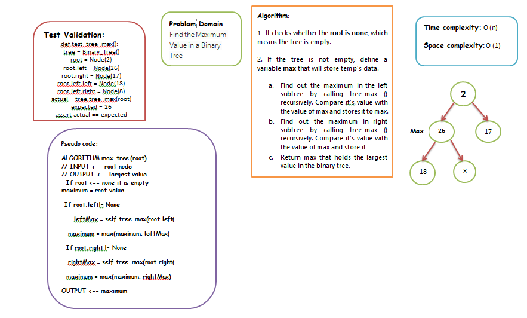

# Binary Tree and BST Implementation

1. Build Binary_Tree class Define a method for each of the depth first traversals:
         * pre-order
         * in-order
         * post-order
which returns an array of the values, ordered appropriately.

2. Create a Binary Search Tree class Define methods :
         *Add
         * Contains

## Approach & Efficiency

pre-order: time O(n), space O(n)
in-order: time O(n), space O(n)
post-order: time O(n), space O(n)
Add: time O(logn), space O(1)
Contains: time O(logn), space O(1)

### API

pre-order: method that return tree in order: node=> left=> right =>
in-order: method that return tree in order: left=> node=> right =>
post-order: method that return tree in order: left=> right=> node =>
Add: to add a value to a tree by binary search algorithm
Contains: to check if the tree contains a value

# Challenge Max Tree

Find the maximum value stored in the tree. You can assume that the values stored in the Binary Tree will be numeric.

## Whiteboard Process



## Approach & Efficiency

 i used recursion approach to  find out the largest node in the given binary tree. i first defined variable max that holds root's data. Then, we traverse through the left sub-tree to find the largest node. Compare it with max and store the maximum of two in a variable max. Then, we traverse through the right subtree to find the largest node and compare it with max. In the end, max will have the largest node.

- time complexity: O(n)
- space complexity: O(1)

## Solution

```python

def tree_max(self, root):
            """
            find maximum value
            Returns: number
            """
            try:

                #Check whether tree is empty Base case
                if(root == None):
                    print("Tree is empty")
                    return 0

                else:
                    #Variable maximum will store temp's data
                    maximum = root.value

                    #It will find largest element in left subtree
                    if(root.left != None):
                        leftMax = self.tree_max(root.left)
                        #Compare variable maximum with leftMax and store greater value into maximum
                        maximum = max(maximum, leftMax)

                    #It will find largest element in right subtree
                    if(root.right != None):
                        rightMax = self.tree_max(root.right)
                        #Compare variable maximum with rightMax and store greater value into maximum
                        maximum = max(maximum, rightMax)

                    return maximum

            except:
              raise Exception("Error with tree max!!! ")
              ```
